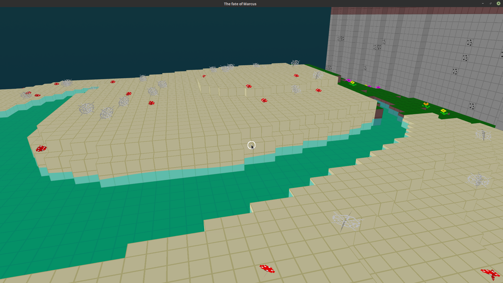
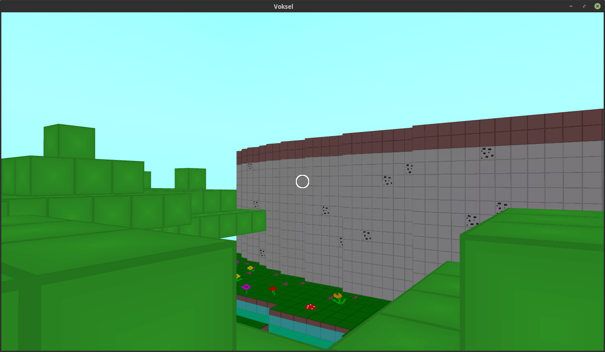
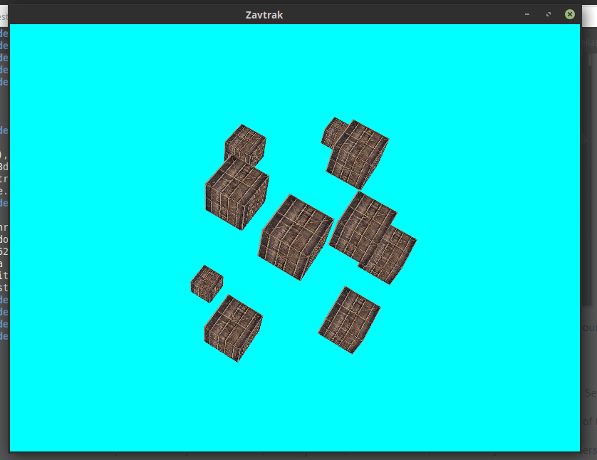
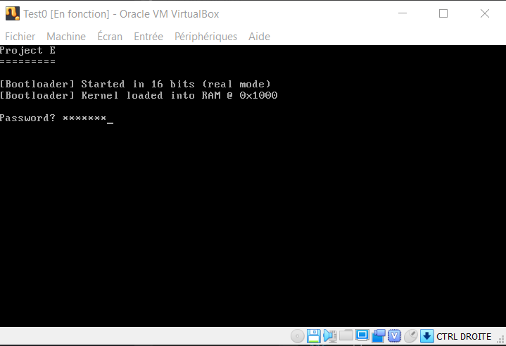

## [ArkScript](https://github.com/ArkScript-lang)

A lisp inspired scripting language made in C++, aiming to be small, fast and a functionnal language for video games and more.

ArkScript is
* small: the compiler, and the virtual machines fit under 5000 lines, but also small in term of keywords (it has only 10)!
* a scripting language: it's very easy to embed it in your application. The builtin construction is quite easy to understand, so adding your own functions to the virtual machine is effortless
* portable: it produces a bytecode which is run by its virtual machine, like Java but without the `OutOfMemoryException`
* a functional language: every parameter is passed by value, everything is immutable unless you use `mut` to define a mutable variable
* powerful: it can handle object oriented programming in a very elegant way with its closures and explicit captures (see examples/church-encoding)
* promoting functionalities before performances: expressiveness often brings more productivity, but performances aren't bad at all
* easy to compile: it takes less than 200ms to compile and check a complex code with a lot of branches and sub-branches of 200 lines.
* a Lisp-like, but with less parentheses: `[...]` is expanded to `(list ...)` and `{}` to `(begin ...)`. More shorthands will come in the future.
* extensible: it is very easy to create a C++ module to use in the language

Also:
* it has a REPL
* it has a growing standard library, composed of ArkScript (under `lib/`) and C++ (under `modules/`)
* it has a lot of unit tests, which are ran before every release to ensure everything work as intended

Fibonacci function:
```clojure
(let fibo (fun (n)
    (if (< n 2)
        n
        (+ (fibo (- n 1)) (fibo (- n 2))))))

(print (fibo 28))  # display 317811
```

Closures with explicit capture:
```clojure
{
    (let countdown-from (fun (number)
        (fun (&number) {
            (set number (- number 1))
            number
        }))
    )
    (let countdown-from-3 (countdown-from 3))
    (print (countdown-from-3))
    (print (countdown-from-3))
    (print (countdown-from-3))
}
```

## [The Fate of Marcus](https://superfola.itch.io/the-fate-of-marcus)

A story driven, audio-visual exploration game taking place in a voxels' composed world. In each game, you discover a brand new world, procedurally generated, in which notes from a previous explorer are hidden, telling his story.

**Gameplay**

The player follows the story of Marcus through his notes scattered all over the world. Marcus was a bored gardener, and when he saw an ad about a space travel to establish a society on another planet, he jumped at the opportunity and boarded right away.

The world, made of voxels, is composed of forests, cliffs, rivers, and flowers (yes, I love flowers, so you will see a lot of them in the game). I tried to recreate a realistic environment through dynamic fog and wind, affecting both flowers and water. Each time the game start up, a brand new world is generated (but the progression of the player is kept, no worries).

[{:height="40%" width="40%" display="inline-block"}](images/tfom_biom.png)
[{:height="40%" width="40%" display="inline-block"}](images/tfom_ig.png)
[{:height="40%" width="40%" display="inline-block"}](images/tfom_tuto.png)

## [Zavtrak](https://gitlab.com/SuperFola/Zavtrak)

A library to simplify the use of OpenGL, trying to act as a (nearly) zero cost abstraction library, used by The Fate of Marcus.

[{:height="40%" width="40%" display="inline-block"}](images/zk_hello_triangle.png)
[{:height="40%" width="40%" display="inline-block"}](images/zk_hello_3d.png)
[{:height="40%" width="40%" display="inline-block"}](images/zk_hello_cubes.png)
[{:height="40%" width="40%" display="inline-block"}](images/zk_hello_light.png)

## [Project-E](https://github.com/SuperFola/project-E)

Project E is a small Operating System (if we can say so) composed of a basic bootloader and of a simple kernel, all written in NASM assembly, capable of execute shell commands. It embeds a password lock when booting, an heterogeneous programming language using a tape (sort of evolved brainfuck), few commands like `echo`, `clear`, `color`, `version` and `help`.

It was developped and tested under Linux Mint 19, on a x86_64 machine.

[{:height="40%" width="40%" display="inline-block"}](images/pe_boot.png)
[{:height="40%" width="40%" display="inline-block"}](images/pe_commands.png)
[{:height="40%" width="40%" display="inline-block"}](images/pe_app.png)